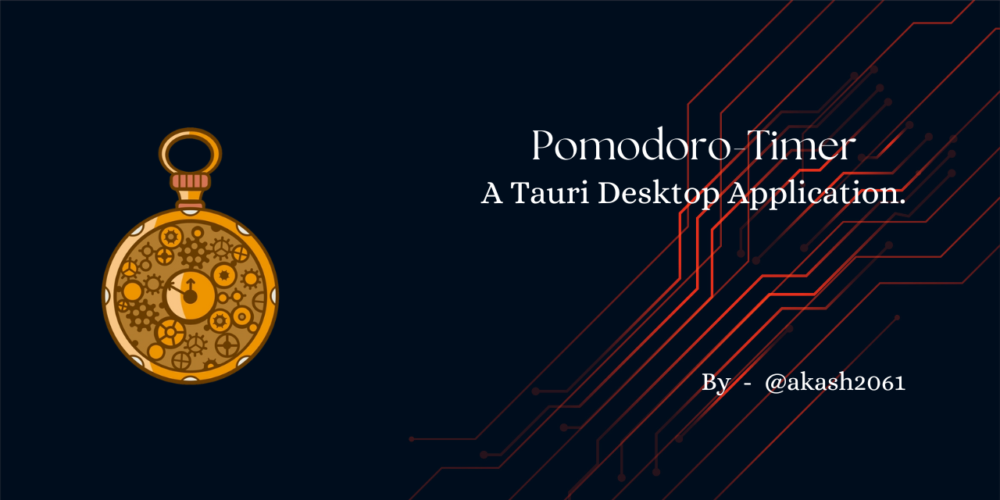
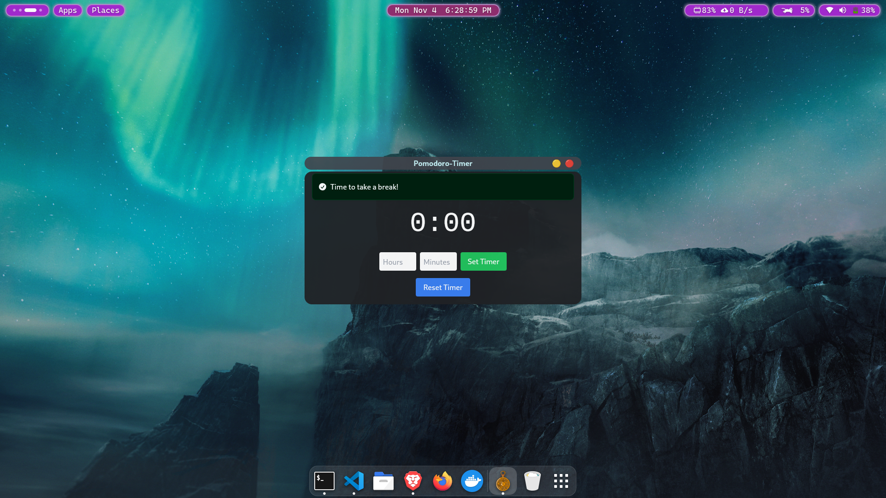

<!-- 
 -->

# Pomodoro Timer App

Welcome to the **Pomodoro Timer App**! This desktop application is designed for users who want an efficient, distraction-free timer to enhance focus and productivity. Built using Rust and Tauri v2, the app features customizable alerts and a modern user interface to streamline your workflow.



## Features

- **Customizable Pomodoro Timer**: Set work and break intervals according to your productivity style.
- **Lightweight and Secure**: Built with Rust and Tauri, ensuring a lightweight footprint and a secure, efficient backend.
- **Sound Alerts**: Custom sounds play to signal the end of each session, enhancing productivity through auditory cues.
- **Compatible**: Exclusively designed for Linux & Windows-11 environments for optimal performance.


## Installation:

### Linux OS:

+ **Install [.deb](https://github.com/akash2061/Pomodoro-Timer-App-Rust/releases/download/v0.1.0/Pomodoro-Timer_0.1.0_amd64.deb)**
    ```ruby
    # cd Downloaded/file/path/
    $ sudo dpkg -i Pomodoro-Timer_<VERSION>.deb
    ```
    ```ruby
    # Run Pomodoro Timer Directly from terminal.
    $ Pomodoro-Timer
    ```

+ **Install [.apm](https://github.com/akash2061/Pomodoro-Timer-App-Rust/releases/download/v0.1.0/Pomodoro-Timer-0.1.0-1.x86_64.rpm)**

### Windows 11:
+ **Install [Setup](https://github.com/akash2061/Pomodoro-Timer-App-Rust/releases/download/v0.1.0/Pomodoro-Timer_0.1.0_x64-setup.exe)**

## Technologies Used

- **Rust**: Core language for developing the application’s backend.
- **Tauri v2**: Framework for building lightweight, cross-platform desktop apps.
- **React**: Frontend built with React for responsive and interactive UI.

## Usage

1. **Set Timer**: Input your preferred Pomodoro interval (work and break times) and start the timer.
2. **Receive Alerts**: Upon completion of each interval, the app window will come to the front, focusing your attention, and an external notification will appear.
3. **Sound Notification**: The app uses Rodio for customizable sound alerts, helping signal your work/break transitions clearly.

## License
This project is licensed under the MIT License. See the LICENSE file for details.

## Acknowledgments
Special thanks to the Tauri and Rust communities for their extensive [documentation](https://v2.tauri.app/) and resources.

Happy productivity! 🎯
